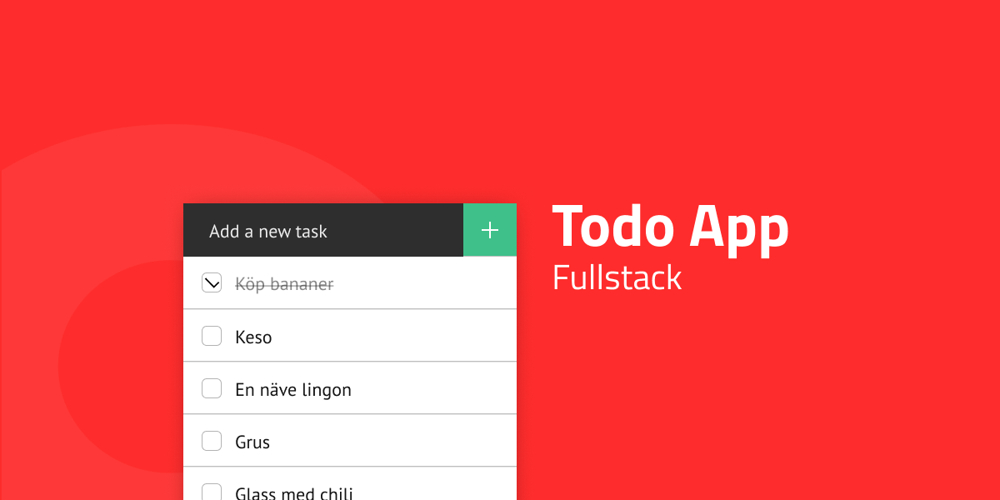

# My Things To Do 
## Web Service - Todo App with Firebase

https://margareta75.github.io/AdComo

Web Service connected to Google's database Firebase (JSON-API).

You need to create an account to use the app.

After logging in, you can only see your own todo-list.

You can create, read, edit and delete todo items from database.

Each task has deadline-date and separate task-description.

You can also edit your account: change username, password and email,
or delete your account from the database.

Have fun!


**********************************************************************************************


# AdComo Todo App

## Steg 1 - CRUD Base
### API
Bygg en Webbtjänst med ett JSON-API som kan skapa, läsa, redigera och ta bort Todo Items.
Dina todos ska sparas Firebase, https://firebase.google.com/
 
Webbtjänsten ska vara strukturerad enligt [MVC](https://techterms.com/definition/mvc) (fast V:et är till en början bara JSON).

#### Model
En Todo ska minst ha en `titel` och ett `done` fält.
 
```js
{
    titel : String,
    done: Boolean
}
```

### Frontend
Nu när du har en fungerande backend så är det nu dags att bygga en FrontEnd som konsumerar webbtjänster med fetch eller axios.

Förslag på gränssnitt hittar du [här](https://material.io/design).

### Levelups

#### Level up 1
Lägg till fält på Todo Items som är när den skapades och när den uppdaterades. Lägg även till på FrontEnd-sidan att man kan sorta listan efter senast skapad eller senast ändrad.

```js
{
    titel : String,
    done: Boolean,
    createdAt: Date,
    updatedAt: Date
}
```

#### Level up 2
Lägg på *pagination* på routen som hämtar alla Todos.

**Exempel**
Om det finns 50st todos  i databasen så ska routen som hämtar alla todos endast hämta de 10 senaste. Men med en query parameter ska man kunna välja nästa 10 todos.


## Steg 2 - Auth
Nu är det dags att göra din app redo för det stora vilda farliga internet. Detta görs genom att skapa **auth-funktionalitet**.

**Authentication** handlar om VEM du är, funkitonalitet som säkerställer att DU är du. Ex. login med *användarnamn* och lösenord.

**Authorization** handlar om VAD du har tillgång till, funktionalitet som avgör vilka resurser i ett system du har åtkomst till samt *vad* (CRUD) du för göra med de resurserna.

### Frontend
På frontend ska man nu kunna logga in med ett användarnamn ( epost? ) och lösenord. På frontenden skall efter authentication genomförst visa *state*, d.v.s. *vem* som är inloggad. Ett tips är att spara en token samt inloggad användare i [sessionStorage](https://developer.mozilla.org/en-US/docs/Web/API/Window/sessionStorage).

### Backend
Du ska utöka ditt API med **RBAC-funktionalitet**. De roller som kan tilldelas är:

|Role|Auth|
|---|---|
|admin| Write, Read, Update, Delete |
|user|Write, Read, Update|

Det är även helt ok att remixa dessa roller eller lägga till egna.


#### Authentication
Ditt API skall utökas med en resurs som heter ```/auth```. Den resursen ska ta emot en *POST* med användarnamn och lösenord och returnera en signerad [JWT](https://jwt.io/).

#### Authorisation
Vid varje anrop till servern skall en token medskickas i headern ( Bearer ). På serversidan så ska ditt API kunna kolla upp vilken ```role``` användaren med just den token har, samt vilka operationer som därmed användaren tillåts göras.

#### Skapa nya användare
Ditt API ska kunna hantera att skapa nya användare. Detta görs med en *POST* till resursen ```/users```. 

Endast administratörer får skapa användare ( dock måste den första ev. hårdkodas in alt. POSTAS in innan auth-funktionaliteten är på plats ).
